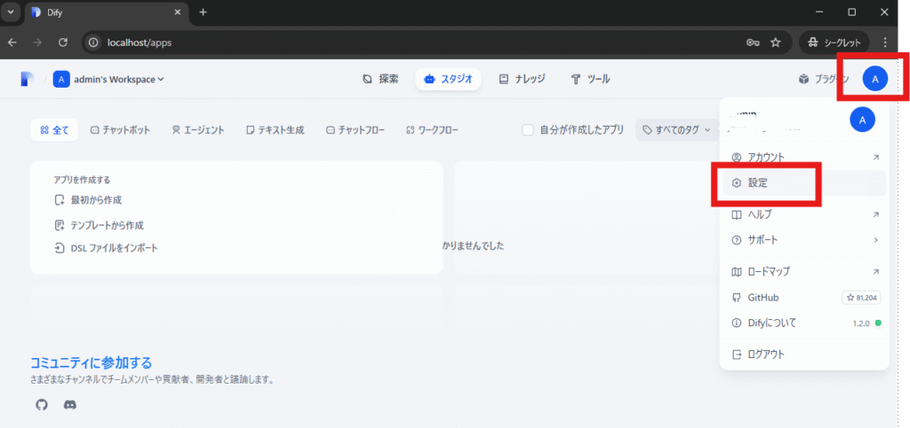
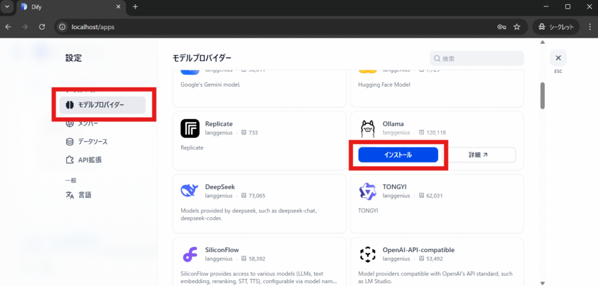
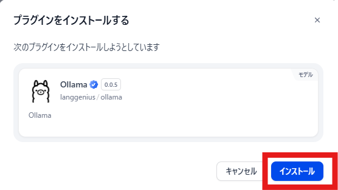
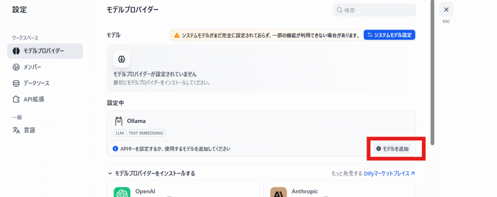
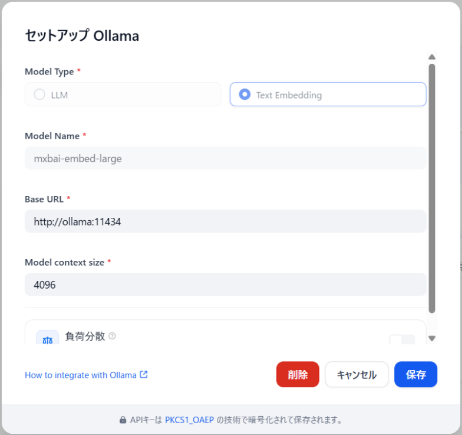
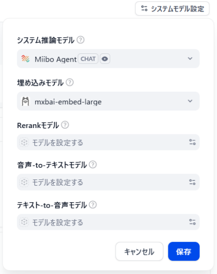

# [DifyナレッジDB利用]dify-plugin-miibo-agent<br>＋Ollama埋め込みモデルの設定

初版：2025.4.28 CTD-Networks-CO-LTD

（参考）
- （Info Circus - knowledge）[Ubuntu 22.04 LTS環境でOllamaをDocker Composeで起動する方法](https://www.serv-ops.net/knowledge/open.knowledge/view/2?offset=0)
- （ ITの困り事を個別対応「福栄ラボ」）[DockerでOllamaとDifyを連携してローカルLLM環境を作る（手順編）](https://www.8asue.com/fukuei/b20250418/)
- （Dify公式）[Ollamaでデプロイしたローカルモデルを統合](https://docs.dify.ai/ja-jp/development/models-integration/ollama)

---

### 1. Ollamaコンテナの作成と埋め込みモデルインストール

1. OllamaのDocker起動フォルダの作成
```
sudo mkdir -p /home/$(whoami)/ollama/docker
```

2. OllamaのDocker起動フォルダへ移動
```
cd /home/$(whoami)/ollama/docker
```

3. `docker-compose.yaml`をヒアドキュメントで作成
```
sudo bash -c "cat << 'EOF' > docker-compose.yaml
version: '3.8'
services:
  ollama:
    image: ollama/ollama
    container_name: ollama
    ports:
      - \"11434:11434\"
    volumes:
      - ./ollama:/root/.ollama
#    deploy:
#      resources:
#        reservations:
#          devices:
#            - capabilities: [gpu]
    restart: always
#    environment:
#      UPLOAD_FILE_SIZE_LIMIT: 150
volumes:
  ollama:
EOF
"
```

4. Ollamaコンテナの起動
```
sudo docker compose up -d
```

5. Ollamaコンテナへのログイン
```
sudo docker container exec -it ollama bash
```

6. [日本語にも対応している "mxbai-embed-large" 埋め込みモデル（embedding model）](https://qiita.com/yuji-arakawa/items/1f6ab3f68b98ff56de12#%E5%9F%8B%E3%82%81%E8%BE%BC%E3%81%BF%E3%83%A2%E3%83%87%E3%83%ABembedding-model%E3%81%AE%E6%BA%96%E5%82%99)インストール
```
ollama pull mxbai-embed-large
```
```
#(インストール完了後）
exit
```

### 2. DifyにてOllama埋め込みモデルの設定

1. Difyに管理者でログイン後、管理者アイコンから「設定」の順にクリック


2. 「モデルプロバイダー」をクリック後、モデルプロバイダーからOllamaを探す

<span>
3. 「インストール」をクリック<br>


4. 「モデルを追加」をクリック


5. `mxbai-embed-large` を設定し「保存」をクリック
  ```
  Model Type: Text Embedding
  Model Name: mxbai-embed-large
  Base URL: http://ollama:11434
  ```


<br><br>
6. 「システムモデル設定」をクリック

<br>
7. 埋め込みモデルで「モデルを設定する」から「mxbai-embed-large」を選択し「保存」

