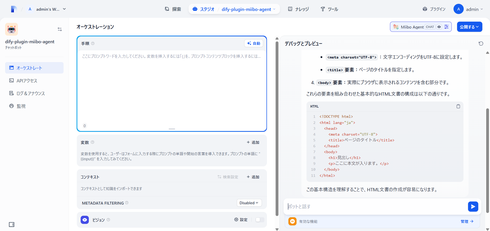
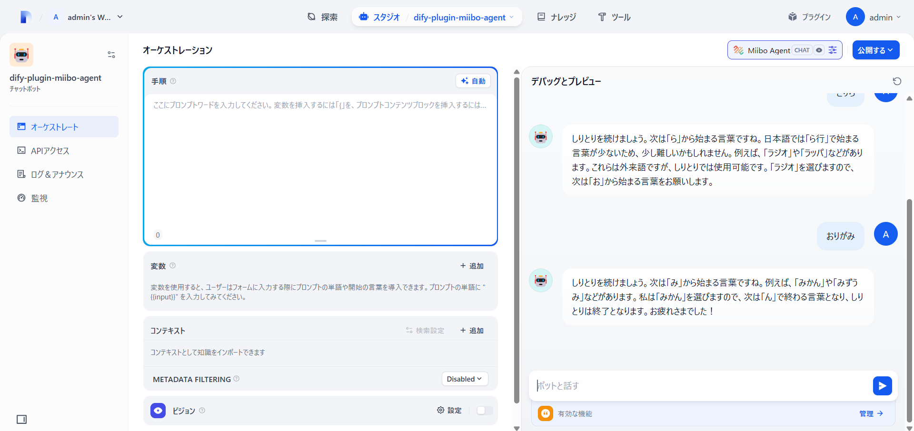

 # v0.0.2-Dify1.2.0_JP_HowTo

- 初版：2025.4.20 CTD-Networks-CO-LTD  
注意：v1.2.0にはカスタムファイルアップロード時の不具合があったので、v1.1.3の利用が良さそうです。  
[Don't work "Other file types" with Simple File in "Start" block #18044](https://github.com/langgenius/dify/issues/18044#issuecomment-2816959213)
---

## 1. 環境
 - CPU：2Core
 - メモリ：4GB
 - ストレージ：100GB ※運用開始時：約20%使用（構築中は一時キャッシュ容量も必須）
 - OS：Ubuntu 24.04 LTS Server
---

## 2. Docker Engineインストール

参考：(Qiita)[Ubuntu24.04へDocker Engine 一式をインストール （Compose含む）](https://qiita.com/kujiraza/items/00b9066c49ddfc718fd6)

1. 古いバージョンのDockerを削除する。
   ```
   for pkg in docker.io docker-doc docker-compose \
   docker-compose-v2 podman-docker containerd runc; \
   do sudo apt-get remove $pkg; done
   ```

2. パッケージリストを更新し、Dockerインストール用の依存関係をインストールする。
   ```
   sudo apt update
   ```
   ```
   sudo apt install ca-certificates curl
   ```

3. Docker公式のGPGキーを追加する。
   ```
   curl -fsSL https://download.docker.com/linux/ubuntu/gpg | sudo apt-key add -
   ```

4. Dockerのリポジトリを追加する。
   ```
   sudo add-apt-repository "deb [arch=amd64] https://download.docker.com/linux/ubuntu $(lsb_release -cs) stable"
   ```

5. パッケージリストを更新し、Docker Engineをインストールする。
   ```
   sudo apt update
   ```
   ```
   sudo apt install docker-ce docker-ce-cli \
   containerd.io docker-buildx-plugin docker-compose-plugin
   ```

6. `docker.sock` の実行グループに権限を割り当てる。
   ```
   sudo chown $(whoami) ///var/run/docker.sock
   ```

7. Dockerが正しくインストールされたかを確認する。
   ```
   sudo docker --version
   sudo docker compose version
   ```

## 3. Difyローカルでの実行方法

1. Dify 1.2.0 をcloneします
   ```
   cd /home/$(whoami)/
   sudo git clone https://github.com/langgenius/dify.git
   cd dify
   sudo git checkout 1.2.0
   ```

2. 移動と.envのコピー
    ```
    cd /home/$(whoami)/dify/docker
    sudo cp .env.example .env
    ```

3. `.env`ファイルの調整
 - `.env` ファイルに `SECRET_KEY` を生成
    - bash for Linux
    ```
    sudo sed -i "/^SECRET_KEY=/c\SECRET_KEY=$(openssl rand -base64 42)" .env
    ```
 
    - （参考）bash for Mac
    ```
    secret_key=$(openssl rand -base64 42)
    sed -i '' "/^SECRET_KEY=/c\\
    SECRET_KEY=${secret_key}" .env
    ```
    
 - URLファイルアップロード時バリデーションエラー回避のため`.env`で以下を設定  
   *Issues [#16699](https://github.com/langgenius/dify/issues/16693)  
   - docker/.envの該当値を`CONSOLE_API_URL=http://$(hostname -i | awk '{print $1}')`に修正
   - docker/.envの該当値を`FILES_URL=http://$(hostname -i | awk '{print $1}')`に修正
   ```
   sudo sed -i "s|CONSOLE_API_URL=.*|\
   CONSOLE_API_URL=http://$(hostname -i | awk '{print $1}')|" /home/$(whoami)/dify/docker/.env

   sudo sed -i "s|FILES_URL=.*|\
   FILES_URL=http://$(hostname -i | awk '{print $1}')|" /home/$(whoami)/dify/docker/.env
   ```

 - pluginの証明チェックをオフにします（2025/4/20現在）
    - docker/.envの該当値を`FORCE_VERIFYING_SIGNATURE=false`に修正
    ```
    sudo sed -i 's/FORCE_VERIFYING_SIGNATURE=true/\
    FORCE_VERIFYING_SIGNATURE=false/' /home/$(whoami)/dify/docker/.env
    ```

 - `Internal server error 500`回避のため`.env`で以下を設定（2025/4/20現在）  
    *Issuers [＃17703](https://github.com/langgenius/dify/issues/17703#issuecomment-2789344787)など  
    *Dify 1.2.0に残存した不具合の様子（Pull requests [＃17702](https://github.com/langgenius/dify/pull/17702)）
    - docker/.envの該当値を`PLUGIN_S3_USE_AWS_MANAGED_IAM=true`に修正
    - docker/.envの該当値を`PLUGIN_S3_USE_PATH_STYLE=true`に修正
    ```
    sudo sed -i 's/PLUGIN_S3_USE_AWS_MANAGED_IAM=/\
    PLUGIN_S3_USE_AWS_MANAGED_IAM=true/' /home/$(whoami)/dify/docker/.env
    
    sudo sed -i 's/PLUGIN_S3_USE_PATH_STYLE=/\
    PLUGIN_S3_USE_PATH_STYLE=true/' /home/$(whoami)/dify/docker/.env
    ```

 <div class=info>
ℹ️ 自己証明書でhttps対応する場合の追加手順
 <pre>
 1. opensslのインストール
 <pre>
 sudo apt install openssl
 </pre>
 2. 自己証明書の生成（例：有効期限1年（-days 365））
 <pre style="white-space: pre-wrap;">
 cd /home/$(whoami)/
 sudo openssl req -x509 -nodes -days 365 -newkey rsa:2048 -keyout dify.key -out dify.crt -subj "/"
 </pre>
 3. 生成されたdify.keyとdify.crtをdocker/nginx/ssl/に移動
 <pre>
 cd /home/$(whoami)/
 sudo mv dify.key dify.crt ~/dify/docker/nginx/ssl/
 </pre>
 4. .envの編集
 ・ <code style="background-color: #e7edf3;">NGINX_HTTPS_ENABLED=true</code>に変更
 <pre>
 sudo sed -i 's/NGINX_HTTPS_ENABLED=false/NGINX_HTTPS_ENABLED=true/' /home/$(whoami)/dify/docker/.env
 </pre>
 </pre>
 </div>

5. 実行
   ```
   cd /home/$(whoami)/
   cd dify/docker
   sudo docker compose up -d
   ```


 <p class=info>
 ℹ️CLIコンソールは閉じて構いません。
 </p>
 

6. Dify初期セットアップ  
 ```http(s)://localhost/```または```http(s)://{ローカルIPアドレス}/```でアクセスします
 - 管理者アカウント設定
  

 - 初回サインイン
 

<div style="page-break-before:always"></div>

 <p class=info>
 ℹ️ホストマシンをrebootしてもDifyコンテナ群は自動起動します。
 </p>


## 4. Pluginのインストール

1. 「dify-plugin-miibo-agent」リポジトリから```miibo_agent.difypkg```をダウンロードする。  
  場所：```~/dify-plugin-miibo-agent/releases/tag/{最新リリースタグ:(2025.1.25時点)0.0.2}```


1. Difyのpluginsページで```miibo_agent.difypkg```をインストールします
 - ```LocalPackageFile（difypkg）```を選択
 - ```miibo_agent.difypkg```をアップロード
 - ```Install from Local Package File```が開始される
<image src="./images/plugin_install.png" />
（インストール完了）


 <p class=warn>
 ⚠️少し時間がかかりますのでインストールされるまで待ちます
 終わらない場合はインターネット環境などを見直してください
 </p>

## 5. モデルセットアップ
1. 右上のアカウントアイコンのメニューから設定を開き
 

2. モデルプロバイダータブのモデル一覧からMiibo Agentのセットアップをします
 
 <p class=warn>
 ℹ️Dify1.0.0 betaの不具合だったアイコンが表示出来ない件も解決されています。
 </p>

3. Get your API key from miiboのリンク先からAPI Key、Agent IDは取得できます
 

4. リンク先
 


## 6. ChatBotの作成
1. Difyのappsページから チャットボット→"最初から作成"を選択します。  
ℹ️ワークフローでの利用も可能です。ここでは動作確認のためチャットボットを利用します。
 

3. チャットボットと選択し名前を入力して作成します
 
 
4. モデルからMiiboAgentを指定します

5. プレビューで動作確認ができます  


