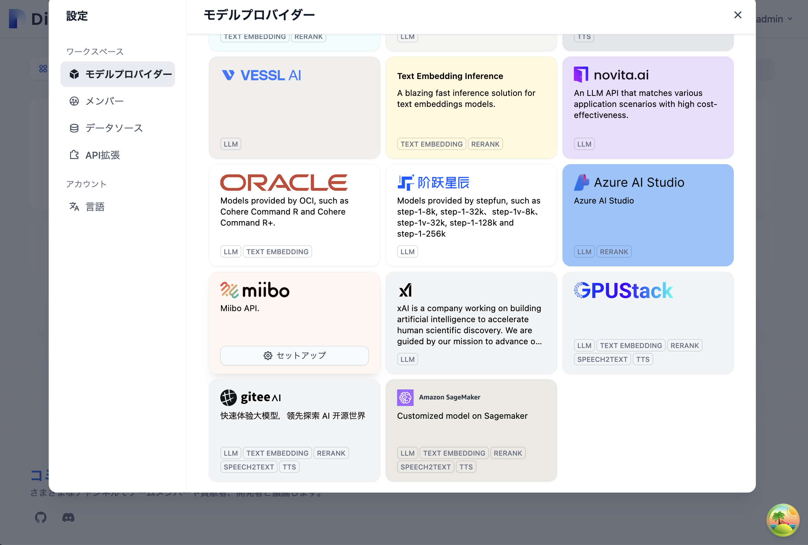

# Difyローカルでの実行方法
1. Dify 1.0 betaをcloneします

    ```shell
    git clone https://github.com/langgenius/dify.git
    cd dify
    git checkout 1.0.0-beta.1
    ```


2. Dockerの実行
まずは移動と.envのコピー

    ```bash
    cd dify
    cd docker
    cp .env.example .env
    ```
3. Generate a `SECRET_KEY` in the `.env` file.

   bash for Linux
   ```bash for Linux
   sed -i "/^SECRET_KEY=/c\SECRET_KEY=$(openssl rand -base64 42)" .env
   ```
   bash for Mac
   ```bash for Mac
   secret_key=$(openssl rand -base64 42)
   sed -i '' "/^SECRET_KEY=/c\\
   SECRET_KEY=${secret_key}" .env
   ```

4. pluginの証明チェックをオフにします（2025/1/16現在）
    
    docker/docker-compose.yaml:L408に下記を追加

    ```
    FORCE_VERIFYING_SIGNATURE: ${FORCE_VERIFYING_SIGNATURE:-false}
    ```

    docker/.envに下記を追記

    ```
    FORCE_VERIFYING_SIGNATURE=false
    ```


5. 実行

    ```bash
    docker compose up -d
    ```

    初回に証明書の再作成が必要な場合がありますので念の為実行します（2025/1/16現在）

    ```bash
    docker exec -it docker-api-1 poetry run flask reset-encrypt-key-pair
    ```


# Pluginのインストール
http://localhost/plugins
からLocalPackageFile（difypkg）をインストールします


少し時間がかかりますのでインストールされるまで待ちます
1.0.0 beta.1の問題でインストールのタイムアウトが30秒になっています
終わらない場合はインターネット環境などを見直してください


# モデルセットアップ
1. 右上のアカウントアイコンのメニューから設定を開き


2. モデルプロバイダータブのモデル一覧からMiibo Agentのセットアップをします



3. Get your API key from miiboのリンク先からAPI Key、Agent IDは取得できます


4. リンク先


# ChatBotの作成
1. http://localhost/apps
から　チャットボット->"最初から作成"を選択します


2. チャットボットと選択し名前を入力して作成します


3. モデルからMiiboAgentを指定します

4. プレビューで動作確認ができます


